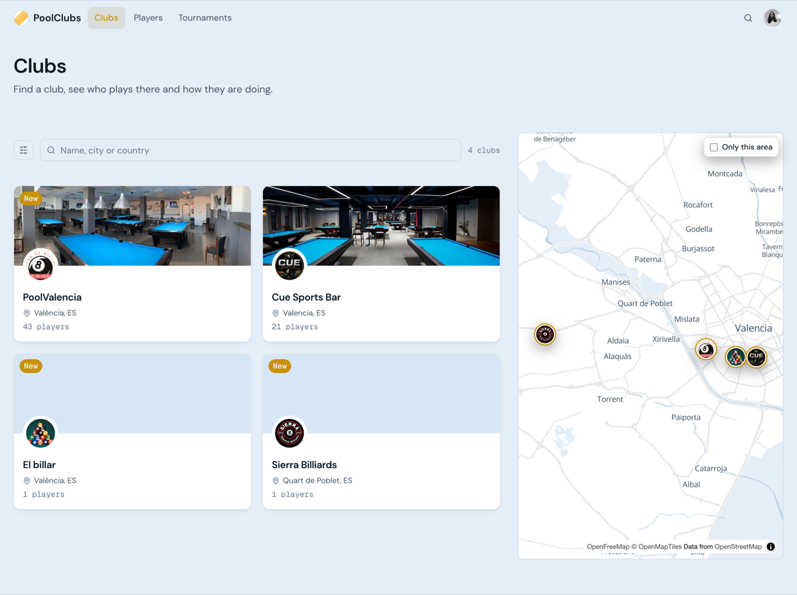
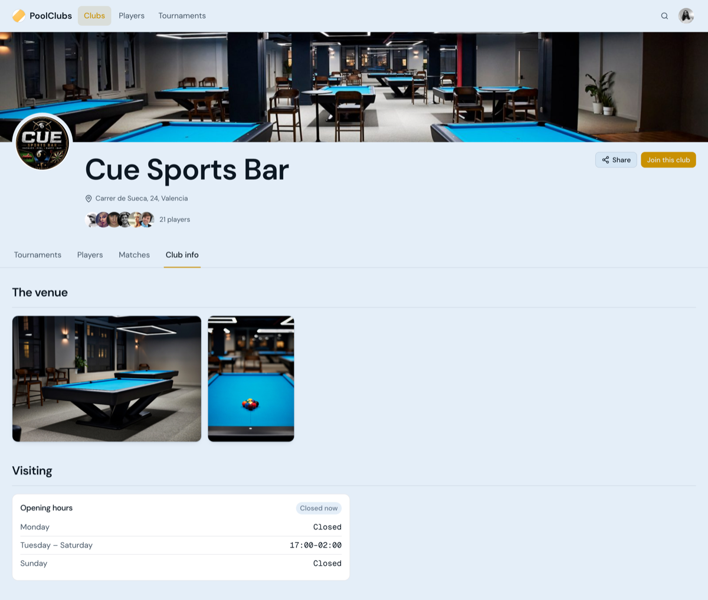
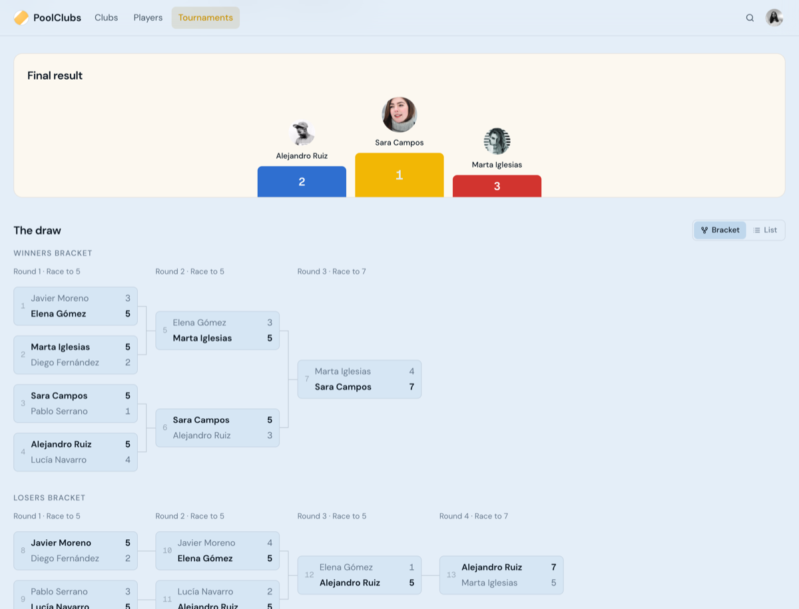
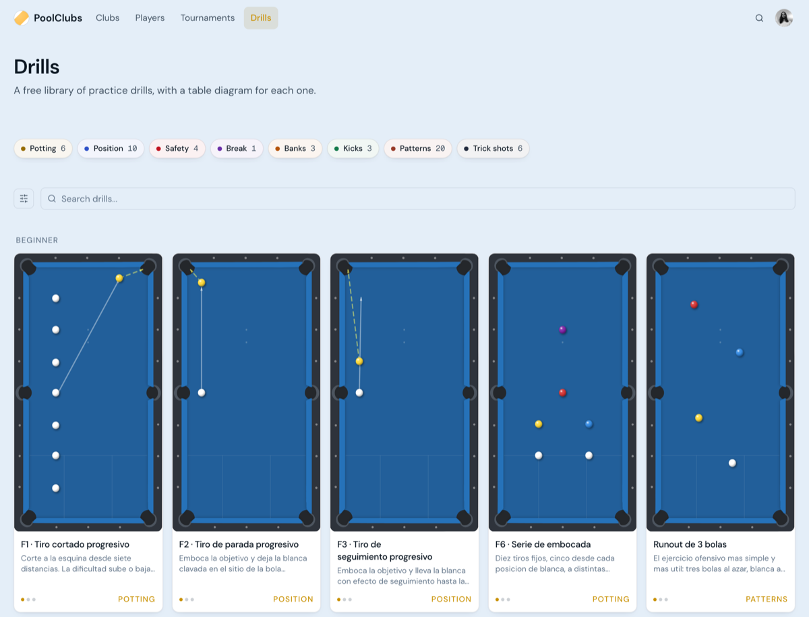
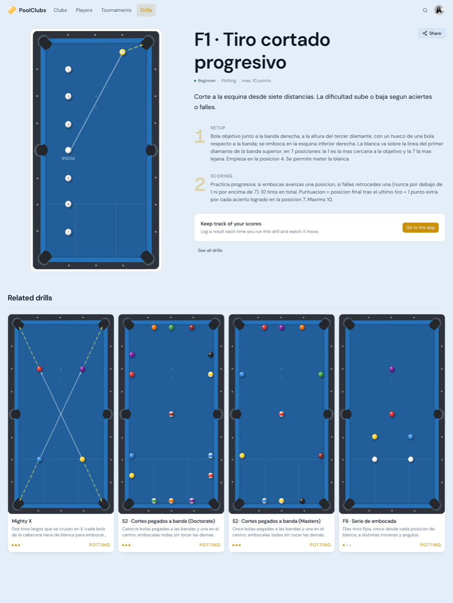
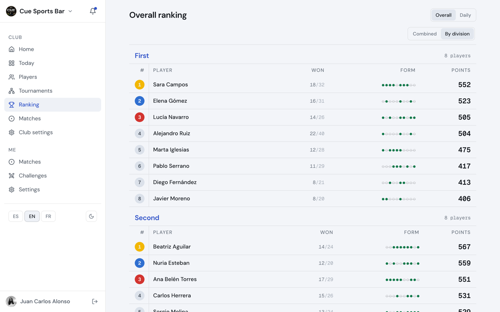
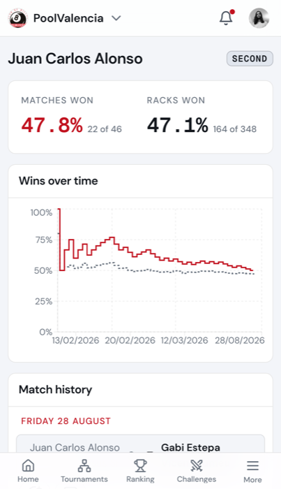

# 🎱 PoolClubs

> The ultimate social network and practice companion for pool enthusiasts.

[](LICENSE)
[](CONTRIBUTING.md)

**Live:** [poolclubs.app](https://poolclubs.app)

---

## 🌟 Overview

**PoolClubs** brings pool players together on a single platform. Whether you want to practice targeted drills, challenge local players to matches, climb competitive rankings, or build a thriving community at your local pool hall, PoolClubs gives you the tools to elevate your game and stay connected.

---

## 📸 A look at it

**The club directory** — `/clubs`



**A club, as anyone can see it** — `/clubs/$slug/info`



**A tournament bracket** — `/tournaments/$id`



**The drill library** — `/drills`



**One drill: diagram, setup, scoring** — `/drills/$id`



**A club ranking, split by division** — `/app/$clubSlug/ranking`



**Your own page, on a phone** — `/app/$clubSlug/me`



---

## ✨ Key Features

### 🏆 Tournaments & Leagues

- **Three formats:** double elimination, group stage + knockout, and leagues (each pair meets a set number of times).
- **Couples tournaments:** doubles pairs, with an optional rule on which divisions can pair up.
- **Rack-by-rack results:** every rack is recorded, runouts included.
- **League tables:** standings, a grid of every game, and points per game won or played.
- **Public pages and share cards:** brackets and results at `/tournaments`, with server-rendered OG images for clubs, games, players and tournaments.

### 🔴 YouTube Streaming & Match Recording

Every club table with a camera can stream to the club's own YouTube channel.

- **Connect once:** a club admin links the club's YouTube channel with Google sign-in. Each table then gets its own stream, created automatically when its camera URL is saved.
- **Streams only when needed:** a server job checks every minute and starts a broadcast only while a match is on that table. Tournament matches always stream publicly. Other games stream only if recording is ticked when the match is started, with the privacy picked there.
- **One video per match:** recordings are split and titled per match, and players get an email with the YouTube link when their video is ready.
- **Scoreboard overlay:** live score overlays for OBS, per table (`/overlay/table/…`) and per tournament match (`/overlay/$tournamentId/$matchId`).
- **OBS setup:** a downloadable OBS scene collection, an OBS dock page for running matches from inside OBS, and `find-cameras` scripts (Windows and Mac/Linux) to find the table cameras on the club's network.
- **Admin page:** camera and stream settings per table at `/app/$clubSlug/club/streaming`.

### 📺 Live Scoreboards

- **Tablet scoreboards:** full-screen, kiosk-style scoreboards for club tablets, paired to a table, with a one-tap rematch.
- **TV view:** a wall screen for the club, showing live matches and today's games.

### ⚔️ Games, Rankings & Challenges

- **Game logging:** scores, match history and head-to-head records. Admins can edit or delete games.
- **Club rankings:** split by division, plus a daily ranking with a month calendar.
- **Ranking nights:** a guided flow for running a club's weekly ranking evening.
- **Challenges:** challenge other players in your club.

### 🎯 Drills & Training

- **Drill library:** browse and create drills with table diagrams, setup and scoring. A shared catalog, plus drills each club makes for itself.
- **Table drills:** run a drill on a club table.
- **Training plans:** personal plans, with results and progress tracked over time.
- Switchable with one flag in [`src/libs/algorithms/features.ts`](src/libs/algorithms/features.ts).

### 🏠 Clubs

- **Public club pages:** hours, description, venue photos, players, games and tables, searchable in the `/clubs` directory.
- **Joining:** join requests, printable invites, and ownership claims for listed clubs, with email notifications.
- **Admin tools:** members, tables, streaming settings, and an operator dashboard (`/app/ops`).
- **Per-club setup:** timezone-aware day boundaries and an installable PWA per club.
- **No club needed:** players can use the app without joining a club.
- **Pricing:** €15/month flat per club, at [`/pricing`](https://poolclubs.app/pricing).

### 💬 Social

- **Activity feed:** match results and club activity, filtered to your membership period.
- **Comments and mentions:** comment, edit comments and @mention players.
- **Notifications:** in-app and web push.

---

## 🛠 Running it

Requires the Node version in `.nvmrc`. Docker + the
[Supabase CLI](https://supabase.com/docs/guides/cli) are needed for
`db:dump` / `db:types` (see `sql/README.md`).

```bash
npm install
npm run dev      # SSR dev server on :3000
npm run build    # vite build, then a typecheck
npm run lint
npm run test     # Vitest
```

Copy `.env.example` to `.env`. It needs `VITE_SUPABASE_URL` and
`VITE_SUPABASE_ANON_KEY`. Both are public by design; RLS is the security
boundary, not the key.

Web push adds `VITE_VAPID_PUBLIC_KEY` and `VAPID_PRIVATE_KEY` — `npx web-push
generate-vapid-keys` makes a pair. Only the public half is prefixed, because
Vite inlines every `VITE_*` into the client bundle and the signing key must not
go there. Without them the feature switches itself off rather than breaking.

YouTube streaming adds `YOUTUBE_CLIENT_ID` and `YOUTUBE_CLIENT_SECRET` (a Google
Cloud OAuth client with the YouTube Data API v3), `TOKEN_ENCRYPTION_KEY`
(`openssl rand -hex 32`, encrypts refresh tokens and stream keys at rest) and
`SUPABASE_SERVICE_ROLE_KEY`. None are `VITE_*`: only server routes and the
once-a-minute reconciler in
[`netlify/functions/youtube-reconcile.mts`](netlify/functions/youtube-reconcile.mts)
read them. Without them the reconciler does nothing.

## 🧱 How it fits together

**TanStack Start** (React + Vite, server-rendered) with **file-based routes** in
[`src/routes/`](src/routes/), **Supabase** for data and auth, **TanStack Query**
for the client cache, **Tailwind 4** for styling. Deployed to Netlify. Each
library and service, and where it lives, is listed in
[`ARCHITECTURE.md`](ARCHITECTURE.md).

A few things worth knowing before changing it:

- **The URL owns the club.** Every page a member uses lives under
  `/app/$clubSlug/…`, and the slug is resolved against the memberships the
  session already carries — a club you are not in reads as not-found. Links are
  written as route patterns (`to="/app/$clubSlug/players/$playerId"`), so a typo
  is a build error. [`AppLink`](src/components/layout/AppLink.tsx) fills the club in.
- **Auth is server-side.** Sign-in, sign-up, sign-out and the Google round trip
  are server functions in [`src/libs/server/auth.functions.ts`](src/libs/server/auth.functions.ts);
  the session lives in httpOnly cookies that both the server and the browser
  client read. `beforeLoad` turns unauthorised requests away before any loader
  runs.
- **Initial data comes from route loaders.** Each fetch is a `queryOptions`
  factory in [`src/queries/`](src/queries/), used by both the route's loader and
  the component's hook, so they share one cache key. Filters that a loader keys
  on (games paging, drill filters, the daily ranking's date) live in the URL, not
  in `useState`.
- **Anything that touches `window`, `localStorage` or `new Date()` during render
  runs on the server too.** Theme and language are cookies for that reason;
  see [`src/libs/prefs.ts`](src/libs/prefs.ts).
- **SQL is applied by hand.** See [`sql/README.md`](sql/README.md) — write the
  migration, run it, then `npm run db:dump && npm run db:types`.
